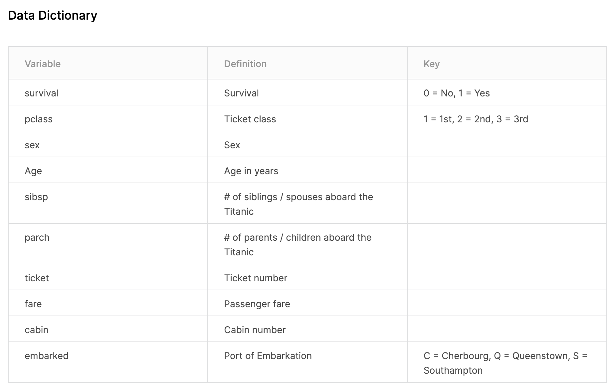

```{r setup, include=FALSE}
knitr::opts_chunk$set(echo = FALSE)

library(tidyverse)

train <- read_csv("data-raw/train.csv")

```

# `train.csv`

From [Kaggle](https://www.kaggle.com/c/titanic/data), here is a breakdown of the variables in the training data, `train.csv`.

\

Here's what the data look like in `R`:

```{r summary}
# the kable() function in knitr makes nice tables
knitr::kable(head(train))
summary(train)
```
